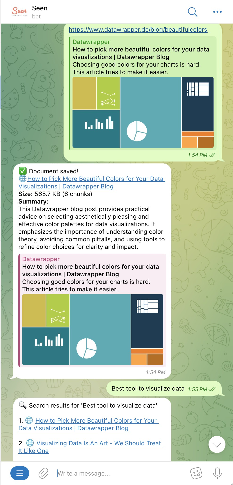

<p align="center">  </p>

Read something but forget where it was? Seen remembers what you have seen.

Seen is a simple personal knowledge management tool made for impatient people like me.

## Features

- Dead simple, just send a link, and search later for whatever you still remember.

- Just a simple telegram bot, no bloatware.

- Cures your allergic to AI by using a lot of AI in this project: document processing, vector search, etc.

## Demo


## Roadmap

Seen is migrating to use [VectorLite](https://github.com/XiangpengHao/vector-lite) as its vector database, allowing lower latency and more reliable service. 

As the natural next step, we will offer a hosted version of Seen.

## Hosted service
Let me know if you are interested in a hosted version of Seen.


## Self-hosting 

Setting up the self-hosted version is a bit complicated. Please let me know if there are any issues.
Self-hosting uses Cloudflare free-tier, should be more than enough for personal use.

### 1. Create a Telegram Bot

Create a Telegram bot (from [@BotFather](https://t.me/BotFather)) and get an API token.

### 2. Configure Cloudflare Workers

Login to Cloudflare:
```bash
npx wrangler login
```

Clone this repository
```bash
git clone https://github.com/XiangpengHao/seen.git
cd seen
```

#### Setup Telegram

1. Add your Telegram bot token to Cloudflare Workers as a secret:

    ```bash
    npx wrangler secret put BOT_TOKEN
    ```
    
    When prompted, paste your Telegram bot token.

2. Get your Chat ID by sending a message to your bot and then visiting: 

    ```
    https://api.telegram.org/bot<BOT_TOKEN>/getUpdates
    ```
    
    Replace <BOT_TOKEN> with your actual bot token. Look for the `chat` object in the response and find your `id`.

3. Add your Chat ID to the environment variables in your wrangler.toml file:

    ```toml
    [vars]
    AUTHORIZED_CHAT_IDS = "YOUR_CHAT_ID"
    ```

    Replace YOUR_CHAT_ID with the chat ID you obtained in the previous step. For multiple authorized users, separate IDs with commas: "ID1,ID2,ID3".

#### Setup CloudFlare
Add your [CloudFlare account ID and API token](https://developers.cloudflare.com/fundamentals/api/get-started/account-owned-tokens/) to Cloudflare Workers as secrets:
```bash
npx wrangler secret put CF_ACCOUNT_ID
npx wrangler secret put CF_API_TOKEN
```

#### Setup Gemini
Seen use Gemini to process documents. You can get a free API key from [Gemini API](https://ai.google.dev/gemini-api/docs/quickstart).

Add your Gemini API key to Cloudflare Workers as a secret:
```bash
npx wrangler secret put GEMINI_API_KEY
```

#### Setup D1 database
```bash
npx wrangler d1 create seen
```
Now you should copy the output to the corresponding field in `wrangler.toml`, e.g.

```toml
[[d1_databases]]
binding = "SEEN_DB"
database_name = "seen"
database_id = "bba483bb-4377-46f1-a8d4-df83772edc95"
```

Configure the database:
```bash
npx wrangler d1 execute seen --command "SQL_BELOW" --remote
```

```sql
CREATE TABLE IF NOT EXISTS links (
    id TEXT PRIMARY KEY,
    url TEXT NOT NULL,
    created_at TEXT NOT NULL,
    bucket_path TEXT NOT NULL,
    content_type TEXT NOT NULL,
    size INTEGER NOT NULL,
    title TEXT NOT NULL,
    summary TEXT NOT NULL,
    chunk_count INTEGER NOT NULL
);
CREATE INDEX IF NOT EXISTS idx_links_url ON links(url);
CREATE INDEX IF NOT EXISTS idx_links_id ON links(id);
```


#### Setup Vectorize
```bash
npx wrangler vectorize create seen-index --dimensions=768 --metric=cosine
```


### 3. Build and Deploy to Cloudflare Workers

Build and deploy your bot to Cloudflare Workers:

```bash
env RUSTFLAGS='--cfg getrandom_backend="wasm_js"' npx wrangler deploy
```

This will deploy your bot and give you a URL (something like `https://your-bot.your-username.workers.dev`).

### 4. Set up Telegram Webhook

Tell Telegram where to send updates by setting up a webhook. Open a browser and navigate to:

```
https://api.telegram.org/bot<BOT_TOKEN>/setWebhook?url=https://your-bot.your-username.workers.dev/webhook
```

Replace `<BOT_TOKEN>` with your actual bot token and update the Worker URL accordingly.

You should see a response like:
```json
{"ok":true,"result":true,"description":"Webhook was set"}
```


## License
MIT 